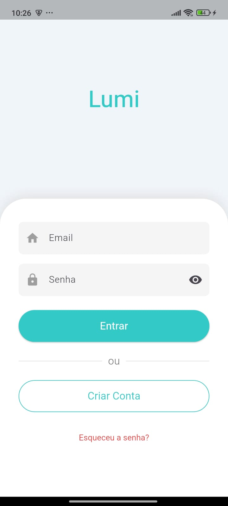
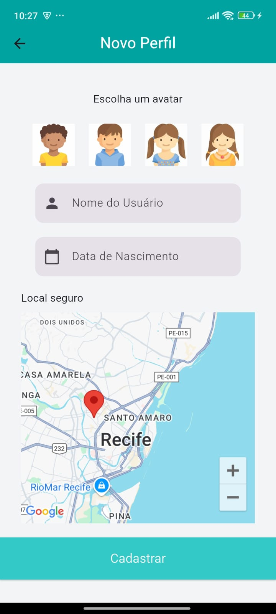
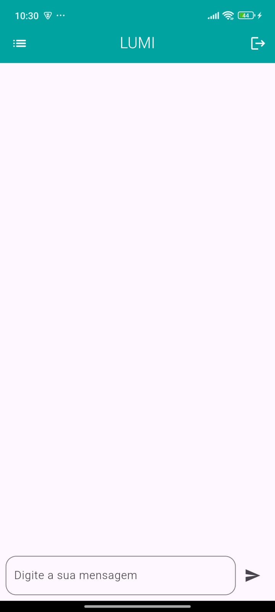
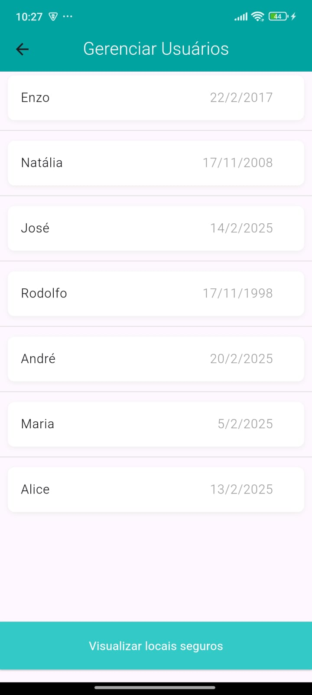

# 📱 Lumi

Uma aplicação desenvolvida com Flutter que integra as API's do gemini para uso de chatbot e maps para um sitema de localização com o intuito de estudar as tecnologias e suas implementações.

## 🚀 Tecnologias Utilizadas

- [Flutter](https://flutter.dev/)
- [Dart](https://dart.dev/)
- [Firebase](https://firebase.google.com/)
- [Gemini IA](https://ai.google.dev/gemini-api)
- [Maps API](https://developers.google.com/maps/)
- Outros pacotes (veja `pubspec.yaml`)

## 🔐 Configuração de Chave API

Para rodar este projeto, você precisa de uma chave de API do firebase.

1. Crie um arquivo `.env` na raiz do projeto.
2. Cole o seguinte conteúdo no arquivo: API_KEY = "Sua_Chave_API_Aqui".
3. Rode o projeto

## 📸 Capturas de Tela

| Tela de Entrada | Tela de Principal | Tela de Cadastro | Tela do ChatBot | Tela de Gerenciamento |
|--------------|------------------|----------------|------------------|----------------|
|  |  |  |  |  |
